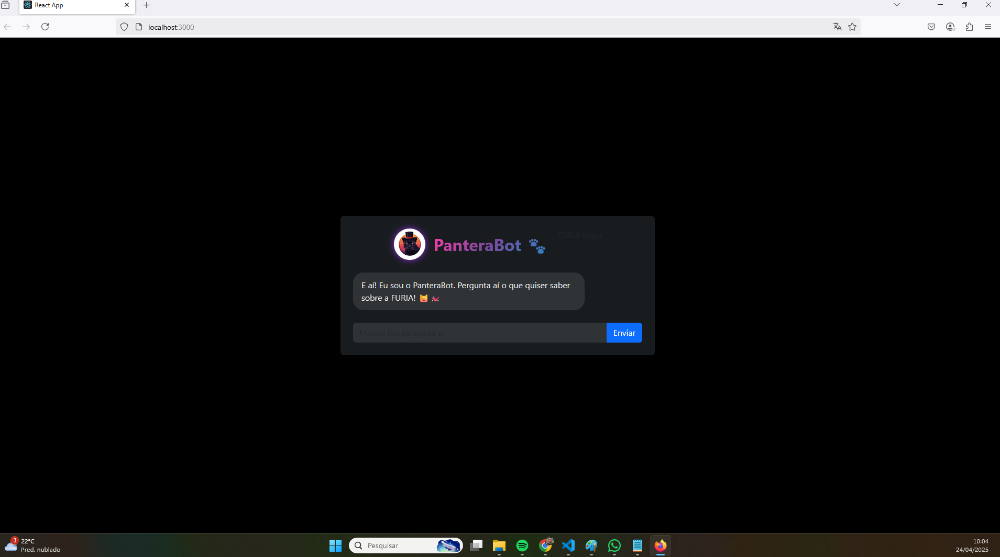
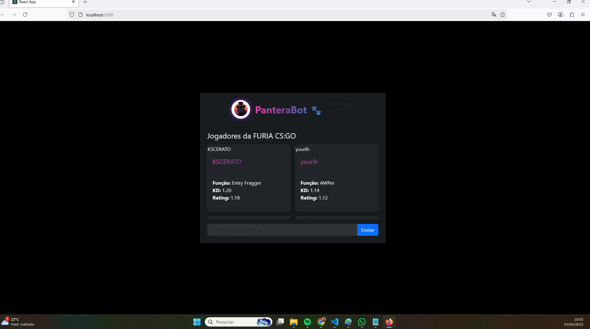

# 🐆 FURIA Chatbot

Um projeto React criado para representar a identidade da equipe FURIA de CS:GO, com visual dark moderno, ícone de pantera e funcionalidades como cards de jogadores, agenda de jogos, notícias e loja.

---

## 💡 O que o projeto faz

Esse chatbot apresenta:

- 🎮 Cards de jogadores da FURIA (imagem, estatísticas, função)
- 🗓️ Agenda de jogos (data, adversário, torneio)
- 📰 Notícias mockadas (título, imagem, resumo)
- 🛒 Área de merch (camisetas, bonés, links para loja oficial)

Tudo isso em um layout escuro, estilizado com Bootstrap e ícones personalizados.

---

## 🚀 Como rodar localmente

1. Clone o repositório:

```bash
git clone https://github.com/SEU_USUARIO/furia-chatbot.git
```

2. Entre na pasta do projeto:

```bash
cd furia-chatbot
```

3. Instale as dependências:

```bash
npm install
```

4. Rode o projeto:

```bash
npm start
```

---

## ⚙️ Tecnologias usadas

- [React](https://reactjs.org/)
- [Bootstrap](https://getbootstrap.com/)
- [JavaScript](https://developer.mozilla.org/pt-BR/docs/Web/JavaScript)
- [ESLint](https://eslint.org/) (para qualidade de código)
- [Vite](https://vitejs.dev/) ou [Create React App] (dependendo do setup inicial)

---

## 📸 Prints

| Tela principal | Card de jogador |
|----------------|-----------------|
|  |  |

> (Você pode substituir os prints pelos reais depois que tirar screenshots!)

---

## 🔗 Link do projeto online

[🔗 Deploy via Vercel/Netlify (se disponível)](https://link-do-seu-site.com)

---

## 👨‍💻 Autor

Feito com 💜 por [Filippe Harnack](https://github.com/FilippeHarnack) 🚀


